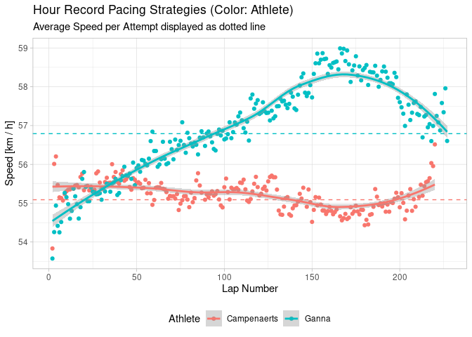

# Idea

The Hour Record is a attempt to drive a bike as far as possible in one
hour. Get the data from two different hour record attempts and compare
the different pacing strategies in the following post. If you want to
reproduce this analysis, you have to perform the following steps:

-   Clone the repository from
    [here](https://github.com/duju211/ganna_hour_record)
-   Install the packages listed in `libraries.R`
-   Run `targets::tar_make()`

# Data

The Data consists of screenshots of the lap numbers and times.

Example image lap number:

Example image lap time:

Get lap number from image:

    nr_from_image <- function(img_path, bw_threshold) {
      image_read(img_path) |> 
        image_quantize(colorspace = "gray") |>
        image_threshold(threshold = bw_threshold) |>
        ocr()
    }

Parse numbers:

    time <- function(df_time_raw) {
      df_time_raw |>
        mutate(
          across(where(is.character), parse_number),
          ind = row_number())
    }

Preprocess data:

-   Nice athlete name
-   Speed in kilometers per hour

<!-- -->

    time_pro <- function(df_time, df_athlete_dir) {
      df_time |>
        mutate(
          athlete = str_remove(athlete, "^df_time_"),
          speed = 0.25 / (time / 60 / 60)) |>
        left_join(select(df_athlete_dir, athlete, distance), by = "athlete")
    }

    ## # A tibble: 444 × 6
    ##    athlete      time lap_nr   ind speed distance
    ##    <chr>       <dbl>  <dbl> <int> <dbl>    <dbl>
    ##  1 campenaerts  24.5      1     1  36.7     55.1
    ##  2 campenaerts  16.7      2     2  53.8     55.1
    ##  3 campenaerts  16.1      3     3  56.0     55.1
    ##  4 campenaerts  16.0      4     4  56.2     55.1
    ##  5 campenaerts  16.2      5     5  55.5     55.1
    ##  6 campenaerts  16.3      6     6  55.2     55.1
    ##  7 campenaerts  16.3      7     7  55.1     55.1
    ##  8 campenaerts  16.3      8     8  55.1     55.1
    ##  9 campenaerts  16.3      9     9  55.2     55.1
    ## 10 campenaerts  16.3     10    10  55.3     55.1
    ## # … with 434 more rows

You can find the preprocessed data as CSV file
[here](https://raw.githubusercontent.com/duju211/ganna_hour_record/master/file_out/hour_record.csv).

# Plot

    vis_time_all <- function(df_time_pro) {
      df_time_pro |>
        filter(lap_nr != 1) |>
        mutate(athlete = str_to_title(athlete)) |>
        ggplot(aes(x = lap_nr, y = speed, color = athlete)) +
        geom_point() +
        geom_hline(aes(yintercept = distance, color = athlete), linetype = 2) + 
        geom_smooth() +
        labs(
          title = "Hour Record Pacing Strategies (Color: Athlete)",
          subtitle = "Average Speed per Attempt displayed as dotted line",
          x = "Lap Number", y = "Speed [km / h]", color = "Athlete") +
        theme(legend.position = "bottom")
    }

    ## `geom_smooth()` using method = 'loess' and formula 'y ~ x'

In the final plot you can see the different pacing strategies of the
attempts.
