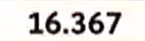

```{r setup, include=FALSE}
source("libraries.R")
```

# Idea

The Hour Record is a attempt to drive a bike as far as possible in one hour.
Get the data from two different hour record attempts and compare the different
pacing strategies in the following post. If you want to reproduce this analysis,
you have to perform the following steps:

* Clone the repository from [here](`r tar_read(repo)`)
* Install the packages listed in `libraries.R`
* Run `targets::tar_make()`

# Data

The Data consists of screenshots of the lap numbers and times.

Example image lap number:

```{r, echo=FALSE}

```

Example image lap time:

```{r, echo=FALSE}

```

Get lap number from image:

```{embed}
"R/nr_from_image.R"
```

Parse numbers:

```{embed}
"R/time.R"
```

Preprocess data:

* Nice athlete name
* Speed in kilometers per hour

```{embed}
"R/time_pro.R"
```


```{r, echo=FALSE}
tar_read(df_time_pro)
```

You can find the preprocessed data as CSV file [here](`r tar_read(csv_url)`).

# Plot

```{embed}
"R/vis_time_all.R"
```

```{r vis_hour_record, echo=FALSE}
tar_read(gg_time_all)
```

In the final plot you can see the different pacing strategies of the attempts.